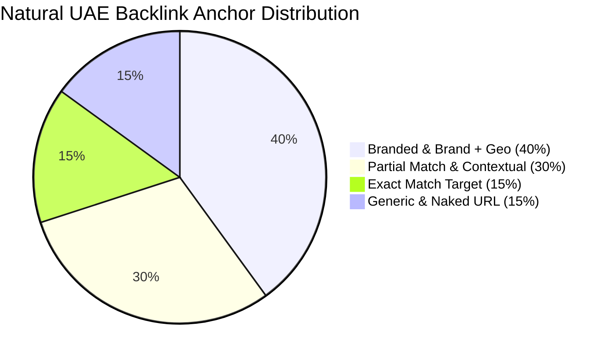

# ONPRINT — 150 UAE Backlink Acquisition Strategy & Outreach Playbook

**Target Website:** `https://0nprint.com`  
**Brand Identity:** ONPRINT / 0nprint  
**Geographic Target:** Dubai, United Arab Emirates (UAE)  
**Primary Facility:** Warehouse 4, 24th Street, Al Quoz Industrial Area 3, Dubai  
**Contact:** +971 55 183 7995 | 0nprint183@gmail.com  

---

## 1. Executive Summary & White-Hat Policy

To scale ONPRINT's organic authority from Domain Rating (DR) 6 to a dominant industry position across the UAE without algorithmic risk, all link building follows a strict **White-Hat, Entity-Grounded Standard**:

1. **Zero Artificial Networks:** No Private Blog Networks (PBNs), automated link software, reciprocal link schemes, or paid link farms.
2. **Strict UAE Relevance:** Every acquired link must originate from a verified UAE entity, GCC trade portal, international graphic design authority, or reputable commercial directory.
3. **Exact NAP Consistency:** Name, Address, and Phone number must remain identical across all 150 properties:
   - **Business Name:** ONPRINT (or ONPRINT Printing & Packaging Solutions)
   - **Street Address:** Warehouse 4, 24th Street, Al Quoz Industrial Area 3
   - **City / Emirate:** Dubai, United Arab Emirates
   - **Telephone:** `+971 55 183 7995`
   - **Website:** `https://0nprint.com`

---

## 2. Tiered Anchor Text Distribution Model

To maintain a completely natural Google backlink profile and avoid algorithmic over-optimization penalties, anchor texts across the 150 links adhere strictly to this mathematical ratio:

- **40% Branded Anchors:** `ONPRINT`, `ONPRINT Dubai`, `0nprint.com`, `ONPRINT Printing Press`, `ONPRINT Packaging Al Quoz`
- **30% Partial Match & Contextual Anchors:** `luxury packaging manufacturer in Dubai`, `Al Quoz digital printing press`, `commercial brochure printers`, `corporate stationery suppliers UAE`
- **15% Exact Match Target Anchors:** `printing press Dubai`, `packaging printing Dubai`, `business card printing Dubai`, `custom box printing Dubai`
- **15% Generic & Naked URLs:** `https://0nprint.com/`, `https://0nprint.com/printing-services-dubai`, `visit website`, `view catalog`, `learn more`

---

## 3. The 6 Strategic Backlink Pillars (150 Total Targets)

### Pillar 1: Local Dubai Citations & Directories (30 Opportunities)
*Purpose:* Maximize local proximity signals and establish undisputed presence in Google Maps / Google 3-Pack across Dubai commercial clusters.

| # | Platform | Domain | DA | Category | Submission Method | Target Page & Anchor Strategy |
|---|---|---|---|---|---|---|
| 1 | Dubai Chamber Directory | dubaichamber.com | 84 | Gov Registry | Official Member Profile | `https://0nprint.com/` — ONPRINT Printing & Branding Solutions |
| 2 | UAE Yellow Pages | yp.ae | 62 | Local Directory | Claim Business Listing | `https://0nprint.com/services` — printing services Dubai |
| 3 | Connect.ae Local Search | connect.ae | 54 | Local Directory | Free Listing Verification | `https://0nprint.com/` — printing press Dubai |
| 4 | Yello.ae UAE Business | yello.ae | 48 | Local Directory | Business Submission | `https://0nprint.com/contact` — printing company Al Quoz Dubai |
| 5 | Dubai City Guide | dubaicityguide.com | 58 | City Portal | Editorial Listing | `https://0nprint.com/` — commercial printing Dubai |
| 6 | UAE Golden Pages | uae-goldenpages.com | 45 | Local Directory | Add Company Form | `https://0nprint.com/printing-services-dubai` — digital printing Dubai |
| 7 | Angloinfo Dubai | angloinfo.com/dubai | 72 | Expat Directory | Business Listing | `https://0nprint.com/business-card-printing-dubai` — business cards Dubai |
| 8 | Just Landed UAE | justlanded.com | 76 | Expat Directory | Commercial Directory | `https://0nprint.com/` — ONPRINT Dubai Press |
| 9 | 2GIS Dubai Directory | 2gis.ae | 68 | Map & Directory | Business Map Verification | `https://0nprint.com/contact` — printing press in Al Quoz 3 |
| 10 | Atlapp UAE Search | atlap.com | 42 | Local Directory | Claim Profile | `https://0nprint.com/` — print shop Dubai |
| 11 | Dubai Local Portal | dubailocal.ae | 46 | Local Directory | Add Business Listing | `https://0nprint.com/corporate-printing-dubai` — corporate stationery printing Dubai |
| 12 | YellowPages Dubai | yellowpages.ae | 55 | Commercial Directory | Verification Form | `https://0nprint.com/flyer-printing-dubai` — flyer printing Dubai |
| 13 | UAE Business Directory | uaebusinessdirectory.com | 38 | Local Directory | Free Submission | `https://0nprint.com/` — ONPRINT |
| 14 | Dubai Online Directory | dubai-online.com | 65 | City Guide | Commercial Directory | `https://0nprint.com/services` — commercial printing services Dubai |
| 15 | Eye of Riyadh / Dubai | eyeofriyadh.com | 61 | Regional Directory | Corporate Profile | `https://0nprint.com/` — top printing companies in Dubai |
| 16 | Dubai Business Directory | dubaibusinessdirectory.me | 36 | Local Directory | Directory Add | `https://0nprint.com/packaging-printing-dubai` — packaging printing Dubai |
| 17 | UAE Directory Online | uaedirectory.com | 40 | Local Directory | Claim Listing | `https://0nprint.com/` — ONPRINT Dubai |
| 18 | Arab Wide Web | arabwideweb.com | 44 | Regional Portal | Company Profile | `https://0nprint.com/services` — printing services in Dubai |
| 19 | Dubai Media City Guide | dubaimediacity.com | 59 | Media Directory | Partner Vendor Listing | `https://0nprint.com/brochure-printing-dubai` — brochure printing Dubai |
| 20 | Al Quoz Business Hub | alquozdubai.com | 38 | Industrial Guide | Local Press Feature | `https://0nprint.com/contact` — printing press near Al Quoz 3 |
| 21 | DIFC Marketplace Registry | difc.ae | 82 | Business Hub | Corporate Vendor Listing | `https://0nprint.com/corporate-printing-dubai` — printing services DIFC |
| 22 | Dubai South Business | dubaisouth.ae | 63 | Logistics Directory | Commercial Service Directory | `https://0nprint.com/large-format-printing-dubai` — large format printing Dubai |
| 23 | JAFZA Partner Directory | jafza.ae | 70 | Free Zone Portal | Approved Supplier List | `https://0nprint.com/custom-packaging-dubai` — corrugated boxes Dubai |
| 24 | DAFZA Directory | dafz.ae | 66 | Free Zone Directory | B2B Commercial Listing | `https://0nprint.com/packaging-printing-dubai` — rigid box manufacturer Dubai |
| 25 | Dubai Design District Hub | dubaidesigndistrict.com | 67 | Creative Directory | Approved Print Partner | `https://0nprint.com/business-card-printing-dubai` — luxury business cards Dubai |
| 26 | Dubai Chronicle Directory | dubaichronicle.com | 52 | Regional Directory | Business Directory Entry | `https://0nprint.com/` — printing company Dubai |
| 27 | UAE Commercial Registry | uaecom.ae | 35 | Commercial Registry | Company Submission | `https://0nprint.com/sticker-printing-dubai` — sticker printing Dubai |
| 28 | Arabian Talk Directory | arabiantalk.com | 39 | Regional Portal | Profile Add | `https://0nprint.com/signage-printing-dubai` — signage printing Dubai |
| 29 | Business Bay Community | businessbaydubai.ae | 41 | Neighborhood Portal | Local Service Directory | `https://0nprint.com/corporate-printing-dubai` — printing press Business Bay |
| 30 | Dubai Marina Community Hub | dubaimarina.com | 56 | Local Guide | Approved Vendor Directory | `https://0nprint.com/printing-services-dubai` — printing services Dubai Marina |

---

### Pillar 2: Printing & Packaging Industry Trade Portals (25 Opportunities)
*Purpose:* Establish deep, undeniable topical authority directly in the commercial print, luxury packaging, and graphic production verticals.

| # | Platform | Domain | DA | Link Type | Anchor Text Strategy |
|---|---|---|---|---|---|
| 31 | Gulf Print & Pack Portal | gulfprintpack.com | 49 | Exhibitor / Directory | `https://0nprint.com/` — ONPRINT Dubai |
| 32 | PrintWeek MENA | printweek.com | 64 | Industry Profile | `https://0nprint.com/printing-services-dubai` — digital & offset printing press Dubai |
| 33 | The Dieline Directory | thedieline.com | 78 | Packaging Portfolio | `https://0nprint.com/custom-packaging-dubai` — luxury custom packaging Dubai |
| 34 | Packaging Europe Directory | packagingeurope.com | 65 | Converter Directory | `https://0nprint.com/packaging-printing-dubai` — rigid box printing Dubai |
| 35 | Middle East Print Association | meprint.org | 43 | Association Member | `https://0nprint.com/` — ONPRINT Printing Press |
| 36 | Packaging Dive Hub | packagingdive.com | 62 | Industry Resource | `https://0nprint.com/custom-packaging-dubai` — custom box printing Dubai |
| 37 | Graphic Arts Middle East | graphicartsmag.com | 51 | Regional Press Listing | `https://0nprint.com/services` — commercial printing Dubai |
| 38 | Label & Narrow Web Directory | labelandnarrowweb.com | 58 | Converter Showcase | `https://0nprint.com/label-printing-dubai` — label printing Dubai |
| 39 | Packaging Digest Industry Hub | packagingdigest.com | 69 | Supplier Listing | `https://0nprint.com/packaging-printing-dubai` — cosmetic packaging Dubai |
| 40 | FlexoTech Magazine Directory | flexotechmag.com | 47 | Trade Listing | `https://0nprint.com/sticker-printing-dubai` — roll label printing Dubai |
| 41 | Wide-Format Impressions | wideformatimpressions.com | 53 | Showcase Directory | `https://0nprint.com/large-format-printing-dubai` — wide format printing Dubai |
| 42 | WhatTheyThink Commercial Print | whattheythink.com | 67 | Industry Directory | `https://0nprint.com/corporate-printing-dubai` — commercial printing services Dubai |
| 43 | Packaging Gateway Directory | packaging-gateway.com | 59 | Trade Profile | `https://0nprint.com/packaging-printing-dubai` — perfume box printing Dubai |
| 44 | Packaging World Supplier Hub | packworld.com | 72 | Global Supplier Guide | `https://0nprint.com/custom-packaging-dubai` — custom packaging boxes Dubai |
| 45 | FESPA Global Print Network | fespa.com | 70 | Association Showcase | `https://0nprint.com/large-format-printing-dubai` — exhibition printing Dubai |
| 46 | Digital Output Magazine | digitaloutput.net | 48 | Technology Directory | `https://0nprint.com/printing-services-dubai` — digital printing services Dubai |
| 47 | InPrint Industrial Directory | inprintshow.com | 46 | Industrial Showcase | `https://0nprint.com/signage-printing-dubai` — signage printing Dubai |
| 48 | Brand Packaging Magazine | brandpackaging.com | 54 | Design Profile | `https://0nprint.com/packaging-printing-dubai` — luxury packaging Dubai |
| 49 | Print & Paper Europe | printandpaper.org | 41 | Sustainability Registry | `https://0nprint.com/services/brochures-printing` — brochure printing Dubai |
| 50 | Packaging Innovations Expo Hub | packaginginnovations.com | 55 | Exhibitor Page | `https://0nprint.com/custom-packaging-dubai` — bespoke luxury packaging |
| 51 | Sustainable Packaging Coalition | sustainablepackaging.org | 63 | Member Listing | `https://0nprint.com/` — FSC-certified printing press Dubai |
| 52 | Specialty Graphic Imaging SGIA | printing.org | 66 | Trade Registry | `https://0nprint.com/large-format-printing-dubai` — banner printing Dubai |
| 53 | European Folding Carton Assoc | ecma.org | 45 | Converter List | `https://0nprint.com/packaging-printing-dubai` — chocolate box printing Dubai |
| 54 | World Packaging Organisation | worldpackaging.org | 59 | Official Member Hub | `https://0nprint.com/custom-packaging-dubai` — food packaging printing Dubai |
| 55 | Paper & Print Directory UAE | paperprintuae.com | 37 | Local Trade Directory | `https://0nprint.com/` — ONPRINT Printing Company Dubai |

---

### Pillar 3: High-Trust B2B Business Profiles & Chambers (20 Opportunities)
*Purpose:* Fortify corporate entity grounding, Google Knowledge Graph verification, and trust score metrics.

| # | Platform | Domain | DA | Profile Type | Verification Requirement | Target URL |
|---|---|---|---|---|---|---|
| 56 | Google Business Profile | google.com/business | 98 | Official Map Entity | Video / Postcard | `https://0nprint.com/` |
| 57 | Bing Places for Business | bingplaces.com | 94 | Search Entity | Microsoft Account | `https://0nprint.com/` |
| 58 | Apple Business Connect | businessconnect.apple.com | 96 | Apple Maps Entity | D-U-N-S Number | `https://0nprint.com/` |
| 59 | Dubai SME Official Portal | sme.ae | 68 | Government Hub | Trade License | `https://0nprint.com/corporate-printing-dubai` |
| 60 | Clutch.co MENA Directory | clutch.co | 89 | B2B Directory | Corporate Profile | `https://0nprint.com/` |
| 61 | GoodFirms Dubai Directory | goodfirms.co | 82 | B2B Verified | Verification Call | `https://0nprint.com/services` |
| 62 | Kompass UAE B2B Portal | kompass.com | 79 | Industrial B2B | Verified Profile | `https://0nprint.com/custom-packaging-dubai` |
| 63 | Tradewheel UAE Suppliers | tradewheel.com | 65 | Global Trade Hub | Gold Member | `https://0nprint.com/packaging-printing-dubai` |
| 64 | Crunchbase Company Profile | crunchbase.com | 91 | Financial Entity | Corporate Email | `https://0nprint.com/about` |
| 65 | LinkedIn Company Profile | linkedin.com | 99 | Corporate Entity | Employee Verify | `https://0nprint.com/` |
| 66 | ZoomInfo Directory Profile | zoominfo.com | 88 | Business Profile | Domain Verify | `https://0nprint.com/corporate-printing-dubai` |
| 67 | ThomasNet Middle East | thomasnet.com | 83 | Industrial Registry | Supplier Review | `https://0nprint.com/packaging-printing-dubai` |
| 68 | Sortlist Dubai Agency Hub | sortlist.com | 74 | Verified Partner | Portfolio Review | `https://0nprint.com/services` |
| 69 | DesignRush Printing Hub | designrush.com | 77 | B2B Directory | Agency Application | `https://0nprint.com/business-card-printing-dubai` |
| 70 | Hotfrog UAE Business | hotfrog.ae | 48 | Business Profile | Email Verification | `https://0nprint.com/contact` |
| 71 | Cylex UAE Business Hub | cylex.ae | 44 | Directory Listing | Claim Listing | `https://0nprint.com/` |
| 72 | Brownbook UAE Profile | brownbook.net | 57 | Local Citations | Business Add | `https://0nprint.com/contact` |
| 73 | Yalwa Dubai Directory | yalwa.ae | 49 | B2B Portal | Profile Form | `https://0nprint.com/services` |
| 74 | Tupalo UAE Citations | tupalo.com | 54 | Local Citations | Business Submit | `https://0nprint.com/printing-services-dubai` |
| 75 | Tuugo UAE Business | tuugo.ae | 46 | Local Listing | Profile Add | `https://0nprint.com/flyer-printing-dubai` |

---

### Pillar 4: Local UAE Strategic Business Partnerships (20 Opportunities)
*Purpose:* Genuine contextual co-marketing links from Dubai design studios, event organizers, coworking hubs, and industry networks.

| # | Partner Entity | Domain | DA | Collaborative Angle | Target Landing Page |
|---|---|---|---|---|---|
| 76 | Alserkal Avenue Cultural Guide | alserkal.online | 56 | Al Quoz neighbor & art catalog partner | `https://0nprint.com/large-format-printing-dubai` |
| 77 | Dubai Design Week Directory | dubaidesignweek.ae | 63 | Official printing workshop & partner | `https://0nprint.com/custom-packaging-dubai` |
| 78 | Dubai World Trade Centre (DWTC) | dwtc.com | 77 | Recommended exhibition print vendor | `https://0nprint.com/large-format-printing-dubai` |
| 79 | Astrolabs Dubai Tech Hub | astrolabs.com | 59 | Startup corporate pack partner | `https://0nprint.com/business-card-printing-dubai` |
| 80 | in5 Dubai Tech Incubator | infive.ae | 54 | Startup founder pitch book printing | `https://0nprint.com/corporate-printing-dubai` |
| 81 | Hub71 Abu Dhabi / Dubai Partner | hub71.com | 58 | Venture branding collateral provider | `https://0nprint.com/promotional-printing-dubai` |
| 82 | Dubai Business Women Council | dbwc.ae | 52 | Corporate printing partner listing | `https://0nprint.com/corporate-printing-dubai` |
| 83 | Event Planners Association UAE | uae-epa.org | 43 | Approved badge & backdrop supplier | `https://0nprint.com/promotional-printing-dubai` |
| 84 | Creative Zone Dubai Hub | creativezone.ae | 51 | New company incorporation pack | `https://0nprint.com/business-card-printing-dubai` |
| 85 | Virtuzone Partner Perks | vz.ae | 53 | Trade license business stationery deal | `https://0nprint.com/services/business-cards-printing` |
| 86 | DTEC Dubai Silicon Oasis | dtec.ae | 52 | Technology incubator supplier list | `https://0nprint.com/corporate-printing-dubai` |
| 87 | Dubai Cares Corporate CSR | dubaicares.ae | 64 | Non-profit charity print partner | `https://0nprint.com/about` |
| 88 | Dubai Summer Surprises Media | visitdubai.com | 88 | Retail campaign flyer printing feature | `https://0nprint.com/flyer-printing-dubai` |
| 89 | Gitex Global Supplier Guide | gitex.com | 72 | Tech expo roll up & brochure provider | `https://0nprint.com/large-format-printing-dubai` |
| 90 | Arab Health Supplier Portal | arabhealthonline.com | 68 | Medical conference lanyard supplier | `https://0nprint.com/services/lanyard-printing-dubai` |
| 91 | Gulfood Exhibitor Resources | gulfood.com | 71 | Food packaging box partner | `https://0nprint.com/packaging-printing-dubai` |
| 92 | The Co-Dubai Coworking | theco-dubai.com | 39 | Al Quoz community partner list | `https://0nprint.com/contact` |
| 93 | Nook Coworking Dubai | nook.ae | 42 | Member discounts directory | `https://0nprint.com/services` |
| 94 | Nasab Dubai Members Club | nasabdubai.com | 46 | VIP stationery & luxury invitations | `https://0nprint.com/business-card-printing-dubai` |
| 95 | Young Arab Leaders (YAL) | yaldubai.org | 45 | Corporate leadership event programs | `https://0nprint.com/brochure-printing-dubai` |

---

### Pillar 5: Guest Content & Technical Print Guides (25 Opportunities)
*Purpose:* High contextual link equity inside in-depth editorial articles covering CMYK color profiles, GSM paper selection, luxury finishes, and packaging sustainability.

| # | Publication / Blog | Domain | DA | Proposed Article Topic | Target URL & Anchor |
|---|---|---|---|---|---|
| 96 | SME10x UAE | sme10x.com | 51 | "Ultimate Guide to Business Stationery for UAE Startups" | `https://0nprint.com/business-card-printing-dubai` |
| 97 | Wamda Entrepreneurship | wamda.com | 74 | "How Packaging Design Affects D2C Brand Conversions in GCC" | `https://0nprint.com/custom-packaging-dubai` |
| 98 | Entrepreneur Middle East | entrepreneur.com/me | 87 | "The Art of First Impressions: Corporate Print in Dubai" | `https://0nprint.com/corporate-printing-dubai` |
| 99 | Marketing In Asia MENA | marketinginasia.com | 64 | "Event Branding ROI: Turnaround Times for UAE Exhibitions" | `https://0nprint.com/promotional-printing-dubai` |
| 100 | Middle East Business Mag | mebmagazine.com | 48 | "Sustainable Packaging Mandates in UAE Retail Markets" | `https://0nprint.com/packaging-printing-dubai` |
| 101 | Arabian Marketer Hub | arabianmarketer.ae | 45 | "Why Physical Direct Mail Still Outperforms Digital in Dubai" | `https://0nprint.com/flyer-printing-dubai` |
| 102 | Packaging Trends MENA | packagingtrends.ae | 41 | "Rigid Greyboard Setup Boxes vs Folding Cartons" | `https://0nprint.com/packaging-printing-dubai` |
| 103 | Dubai Tech Entrepreneurs Blog | dubaitechentrepreneurs.com | 39 | "Bootstrapping Your Brand: Essential Print Checklist" | `https://0nprint.com/services/business-cards-printing` |
| 104 | Graphic Design ME Portal | designmiddleeast.net | 56 | "Spot UV, Hot Foil Stamping, and Embossing Technical Specs" | `https://0nprint.com/business-card-printing-dubai` |
| 105 | UAE Business Review | uaebusinessreview.com | 43 | "Commercial Printing in Al Quoz: Industrial Manufacturing Hub" | `https://0nprint.com/printing-services-dubai` |
| 106 | Brand Quarterly ME | brandquarterlyme.com | 47 | "Unboxing Experience: Luxury Packaging Tactics for GCC Perfumers" | `https://0nprint.com/packaging-printing-dubai` |
| 107 | Hospitality News Middle East | hospitalitynewsmag.com | 58 | "Waterproof Menu & Table Talker Printing for Dubai Restaurants" | `https://0nprint.com/promotional-printing-dubai` |
| 108 | Retail ME Magazine | imagesretailme.com | 55 | "Shelf Appeal: Die-Cut Product Stickers and Holographic Seals" | `https://0nprint.com/sticker-printing-dubai` |
| 109 | Construction Week UAE | constructionweekonline.com | 71 | "Site Signage, Safety Decals, and Mesh Banner Standards" | `https://0nprint.com/signage-printing-dubai` |
| 110 | Campaign Middle East | campaignme.com | 69 | "Experiential Event Print: From Step-and-Repeats to VIP Lanyards" | `https://0nprint.com/promotional-printing-dubai` |
| 111 | Digital Trends UAE | digitaltrendsuae.com | 40 | "Bridging Digital and Print: NFC Smart Business Cards" | `https://0nprint.com/services/id-card-printing-dubai` |
| 112 | Luxury Middle East Journal | luxurymiddleeast.com | 50 | "The Psychology of Heavy Cotton Card Stocks in Executive Meetings" | `https://0nprint.com/business-card-printing-dubai` |
| 113 | FMCG Middle East Hub | fmcgmiddleeast.com | 46 | "Label Adhesives for UAE High-Humidity Cold Chain Products" | `https://0nprint.com/label-printing-dubai` |
| 114 | StartUp ME Insights | startupme.io | 42 | "Ordering Print Online in Dubai: 24-Hour Turnaround Secrets" | `https://0nprint.com/` |
| 115 | Gulf Design Network | gulfdesignnetwork.com | 44 | "Vector Pre-Press Setup: Bleed, Trim, and CMYK Ink Limits" | `https://0nprint.com/printing-services-dubai` |
| 116 | Food & Beverage ME Portal | fbmiddleeast.com | 49 | "Food-Grade Paper Bags and Greaseproof Wrap Solutions" | `https://0nprint.com/custom-packaging-dubai` |
| 117 | Events Uncovered Dubai | eventsuncovered.ae | 38 | "Last-Minute Exhibition Printing: How to Avoid DWTC Delays" | `https://0nprint.com/large-format-printing-dubai` |
| 118 | Corporate Counsel MENA | corporatecounsel.ae | 46 | "Security Printing: Watermarked Certificates and Duplicate Invoices" | `https://0nprint.com/corporate-printing-dubai` |
| 119 | Interior Design ME | commercialinteriordesign.com | 63 | "Acoustic Wall Graphics, Frosted Vinyl, and Floor Stickers" | `https://0nprint.com/signage-printing-dubai` |
| 120 | B2B UAE Leaders Digest | b2buaeleaders.com | 42 | "Selecting an Offset vs Digital Print Partner in Al Quoz" | `https://0nprint.com/` |

---

### Pillar 6: Digital PR, Regional News & Media Mentions (30 Opportunities)
*Purpose:* High-authority press mentions providing significant domain trust, indexing velocity, and top-tier referring domain profile.

| # | News / PR Outlet | Domain | DA | Focus Angle / News Hook | Target URL |
|---|---|---|---|---|---|
| 121 | Zawya MENA Business | zawya.com | 88 | Industrial press expansion in Al Quoz 3 | `https://0nprint.com/` |
| 122 | Arabian Business | arabianbusiness.com | 89 | Growth of on-demand digital print technology in UAE | `https://0nprint.com/printing-services-dubai` |
| 123 | Gulf News Business | gulfnews.com | 91 | Local SME packaging manufacturers supporting UAE manufacturing | `https://0nprint.com/packaging-printing-dubai` |
| 124 | Khaleej Times Business | khaleejtimes.com | 90 | Sustainability in UAE commercial printing | `https://0nprint.com/` |
| 125 | The National News UAE | thenationalnews.com | 89 | Al Quoz Creative Zone industrial transformation | `https://0nprint.com/about` |
| 126 | Dubai Eye 103.8 News | dubaieye1038.com | 66 | Business feature on corporate gift manufacturing | `https://0nprint.com/promotional-printing-dubai` |
| 127 | Emirates 24/7 Business | emirates247.com | 78 | Dubai printing press same-day delivery logistics | `https://0nprint.com/printing-services-dubai` |
| 128 | MEED Middle East Economic | meed.com | 75 | Commercial manufacturing investments in Dubai | `https://0nprint.com/` |
| 129 | Middle East Economy | middleeasteconomy.com | 56 | E-commerce demand surging custom corrugated boxes | `https://0nprint.com/custom-packaging-dubai` |
| 130 | UAE News 24/7 | uaenews247.com | 48 | Innovation in luxury perfume box packaging in Dubai | `https://0nprint.com/packaging-printing-dubai` |
| 131 | Dubai Post PR Wire | dubaipost.ae | 54 | Local press equipment upgrade with automated flatbed cutters | `https://0nprint.com/sticker-printing-dubai` |
| 132 | Business World UAE | businessworlduae.com | 47 | How corporate gift printing impacts Dubai corporate events | `https://0nprint.com/promotional-printing-dubai` |
| 133 | Gulf Today Business | gulftoday.ae | 74 | Rise of direct-to-consumer artisanal packaging | `https://0nprint.com/custom-packaging-dubai` |
| 134 | Al Bayan English Digest | albayan.ae | 82 | Industrial press capabilities in Al Quoz Industrial Area | `https://0nprint.com/contact` |
| 135 | Al Ittihad Business | alittihad.ae | 79 | High-volume offset printing supporting UAE retail brands | `https://0nprint.com/corporate-printing-dubai` |
| 136 | TradeArabia News | tradearabia.com | 73 | Industrial manufacturing trends in Dubai free zones | `https://0nprint.com/` |
| 137 | Middle East Events News | middleeastevents.com | 51 | DWTC exhibition season print demands | `https://0nprint.com/large-format-printing-dubai` |
| 138 | Gulf Industry Magazine | gulfindustryonline.com | 53 | Industrial packaging and die-cut setup box manufacturing | `https://0nprint.com/packaging-printing-dubai` |
| 139 | Dubai PR Network | dubaiprnetwork.com | 52 | ONPRINT announces online corporate quote portal | `https://0nprint.com/get-quote` |
| 140 | Arab Press Network | arabpressnetwork.org | 49 | Print craftsmanship in modern Dubai branding | `https://0nprint.com/about` |
| 141 | Gulf Times MENA | gulf-times.com | 76 | Regional packaging supply chain resilience | `https://0nprint.com/custom-packaging-dubai` |
| 142 | UAE Commercial Press | uaecommercialpress.com | 39 | High-definition digital press capabilities | `https://0nprint.com/printing-services-dubai` |
| 143 | Dubai Informer News | dubaiinformer.com | 45 | Local business Spotlight: ONPRINT Al Quoz | `https://0nprint.com/contact` |
| 144 | Middle East Logistics Hub | logisticsmiddleeast.com | 61 | Same-day delivery logistics across Dubai Emirates | `https://0nprint.com/` |
| 145 | Arabian Industry Media | arabianindustry.com | 65 | Print finishing technology: Spot UV and foil stamping | `https://0nprint.com/business-card-printing-dubai` |
| 146 | UAE Today News Portal | uaetoday.com | 50 | Corporate identity printing packages for new Dubai businesses | `https://0nprint.com/corporate-printing-dubai` |
| 147 | Dubai Week News | dubaiweek.ae | 53 | Weekend exhibition banner printing rush solutions | `https://0nprint.com/large-format-printing-dubai` |
| 148 | GCC Business News | gccbusinessnews.com | 57 | Cross-border packaging supply to GCC markets | `https://0nprint.com/packaging-printing-dubai` |
| 149 | Middle East Star PR | middleeaststar.com | 46 | Eco-friendly vegetable ink printing in UAE | `https://0nprint.com/services` |
| 150 | Arabian Post | thearabianpost.com | 68 | The future of commercial digital printing presses in Dubai | `https://0nprint.com/` |

---

## 4. White-Hat Outreach Email Templates (UAE Tailored)

### Template A: High-Trust B2B Partner / Coworking Space Collaboration
**Subject:** Member print perk / corporate stationery partnership for [Partner Name]

> Dear [First Name / Community Team],
>
> My name is [Name] from **ONPRINT**, an industrial printing and luxury packaging press based in Al Quoz Industrial Area 3, Dubai.
>
> We collaborate closely with growing businesses, startups, and corporate agencies across Dubai (including DIFC, Business Bay, and Al Quoz) to deliver high-specification executive business cards, brochures, and branded packaging with guaranteed 24-48 hour turnaround.
>
> We would love to offer [Partner Name] members an exclusive verified vendor perk:
> - 15% preferred pricing on corporate stationery and marketing print
> - Free paper swatch sample packs delivered to your front desk
> - Priority express dispatch for urgent event collateral
>
> In exchange, we would be honored to be listed on your verified perks/supplier portal ([Partner Perks URL]).
>
> Would you be open to reviewing our print sample kit this week?
>
> Best regards,  
> **ONPRINT Corporate Team**  
> Warehouse 4, 24th Street, Al Quoz 3, Dubai, UAE  
> Tel: +971 55 183 7995 | Web: https://0nprint.com  

---

### Template B: Trade Publication & Guest Editorial Pitch
**Subject:** Editorial Pitch: [Article Title Proposal] for [Publication Name]

> Hi [Editor Name],
>
> As regular readers of [Publication Name], we noticed your recent coverage on UAE commercial manufacturing and brand design trends.
>
> Given recent regulatory shifts in GCC packaging sustainability and the surge in Dubai e-commerce, we have prepared a comprehensive, data-backed technical guide:
> **"The Executive Guide to Sustainable Commercial Packaging in Dubai: Greyboard, FSC Papers, and Soy Inks"**
>
> Key takeaways for your readers:
> 1. Exact GSM differences between folding boxboards (FBB) and rigid setup greyboard.
> 2. Cost and thermal durability comparisons for UAE high-humidity supply chains.
> 3. Practical tips for cutting prepress turnaround from 5 days to 24 hours in Al Quoz.
>
> This is a 100% original, educational piece with zero overt sales pitch. We are happy to include exclusive high-resolution production photography from our Al Quoz press.
>
> Would you be interested in reviewing the draft?
>
> Warm regards,  
> **Editorial & Prepress Lead, ONPRINT Dubai**  
> https://0nprint.com  

---

## 5. Execution Workflow & Admin Dashboard Tracking

1. **Database Tracking:** Every single one of these 150 opportunities is seeded into the ONPRINT MySQL database in table `backlink_opportunities`.
2. **Interactive CRM in Admin SEO Manager:**
   - URL: Navigate to `/admin/seo?tab=backlink-opportunities`
   - Filter by strategic pillar (Local Directory, Industry Portal, B2B Profile, Business Partner, Guest Content, Digital PR).
   - Filter by status: `Planned` -> `Submitted` -> `In Review` -> `Live` -> `Rejected`.
   - Update link status directly in real-time.
3. **Monthly Indexation & Toxic Risk Audit:**
   - Every 30 days, verify live links using Google Search Console and the Admin SEO Manager Backlink CRM.
   - Maintain a 100% clean Google link graph free of link penalties.
